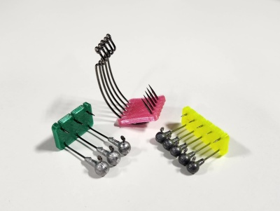
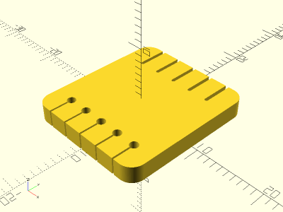
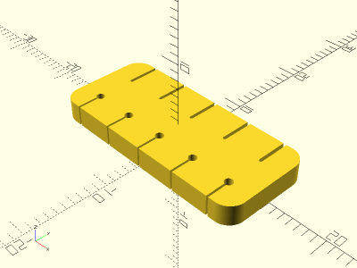

# Parametric Hook Clip

<table>
<tr>
<td></td>
<td></td>
</tr>
<tr>
<td></td>
<td></td>
</tr>
</table>

A parametric clip for fishing hooks. Includes profiles for EWG hooks with 3mm pitch, #2 hooks with 6.5mm pitch (e.g. for 1/16 oz jigheads), and #6 hooks with 5mm pitch (e.g. for 1/32 oz jigheads). Printed with TPU. Made with OpenSCAD.

**Design:** [hook_clip.scad](hook_clip.scad)

**STLs:**

* [ewg_pitch3.stl](stl/ewg_pitch3.stl)
* [size2_pitch6p5.stl](stl/size2_pitch6p5.stl)
* [size6_pitch5.stl](stl/size6_pitch5.stl)

**Recommended Print Settings:** Flexible TPU, 0.20mm layer height, 100% infill, no supports

**Thingiverse:** https://www.thingiverse.com/thing:6085465

**License**: 
